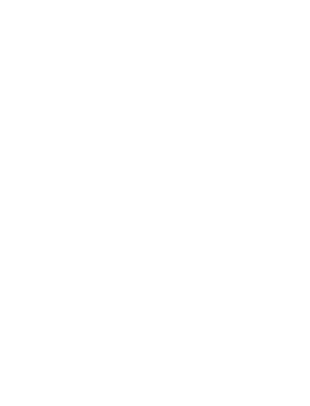

<h1>
  <picture height=23px>
    <source media="(prefers-color-scheme: dark)" srcset="../images/beaker-white.svg" height=23px/>
    <source media="(prefers-color-scheme: light)" srcset="../images/beaker-black.svg" height=23px/>
    
  </picture>
  Transmute
</h1>

Transmute is a self-hosted application distributed under the MIT license. It is free, self-hosted, and without limits, FOREVER!

This application is under active development, want to support us? Give us a star or jump in and contribute!

### Helpful Links
| Resource              | Link |
| --------------------- | ---- |
| Website               | [transmute.sh](https://transmute.sh/) |
| ghcr.io (Primary)     | [transmute-app/transmute](https://github.com/transmute-app/transmute/pkgs/container/transmute) |
| Docker Hub (Fallback) | [neonvariant/transmute](https://hub.docker.com/repository/docker/neonvariant/transmute/general) |
